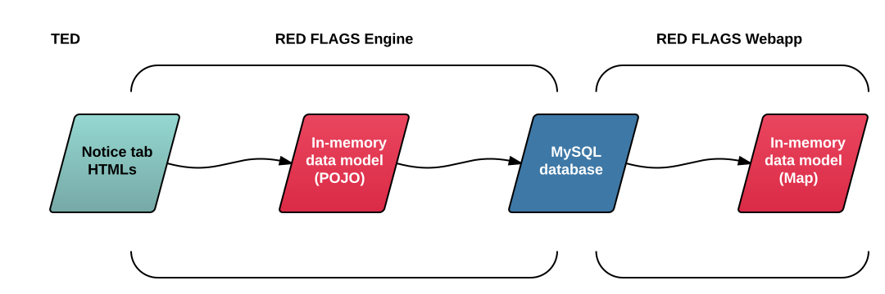

# Data model of RED FLAGS

## Input data

* Public procurements consists of documents called *notices*.
* A *document family* contains notices of one public procurement.
* *Red Flags* uses *TED* to collect the input data.
* It crawls the HTML files for each *tab* of each notice.
* The *TED* URLs have the following format:
<pre>
http://ted.europa.eu/udl?uri=TED:NOTICE:%NOTICEID%:TEXT:%CL%:HTML&src=0&tabId=%TABID%
</pre>
* `%NOTICEID%` is the notice identifier with the format: `number-year`, e.g. `123456-2016`.
* `%CL%` refers to the display language you can choose in the top right corner of the *TED* site, e.g. `EN` or `HU`.
* `%TABID%` tells *TED* which tab needs to be displayed, e.g. `0`.

### Notice tabs on TED

Tab ID | Notice tab                 | Visible when             | Contains
-------|----------------------------|--------------------------|-------------------------------------------------
0      | **Current&nbsp;language**  | CL differs from OL       | very few translated parts of notice
1      | **Original&nbsp;language** | everytime                | whole original notice
2      | **Summary**                | CL differs from OL       | mix of previous two
3      | **Data**                   | everytime                | notice metadata in CL
4      | **Document&nbsp;family**   | min. 2 notices in family | links and very few metadata of notices in family

*(CL = current language set on the website, OL = original language of the notice)*

## Data model (memory)

Data classes and field names in *Red Flags* engine follow the information structure and terminology found on *TED*.

You can find the model classes in the following packages:

* `hu.petabyte.redflags.engine.model`
* `hu.petabyte.redflags.engine.model.noticeparts`

The most important class is `Notice`. It contains fields that **represent the chapters** of a notice. The type definitions of these fields are located in `model.noticeparts` package:

* `Award` (chapter V.)
* `ComplementaryInfo` (chapter VI.)
* `ContractingAuthority` (chapter I.)
* `LEFTInfo` (chapter III.)
* `Lot`
* `ObjOfTheContract` (chapter II.)
* `Procedure` (chapter IV.)

Also there is `Data` class for the *Data* tab, which contains a field for each table row.

Other classes in `model` package are representing **data types**:

* `Address` - organization addresses
* `CPV` - represents a CPV code
* `DisplayLanguage` - enumeration of display language codes
* `Duration` - time durations often appear in documents
* `NoticeID` - helper functions for notice identifiers
* `Organization` - organization data
* `Tab` - enumeration of notice tabs
* `Type` - used in `Data` for representing category-like fields

**Document families** are not managed in separate classes, a document family ID is stored in `Notice` objects instead. The document family ID is the ID of the first notice of the family.

**See them in details here:** [Data classes](/developer/data/classes/)

## Database schema

It is only relevant if you are using **MySQLExporter** and `db=1` in your configuration ([details](/developer/engine/gears/exporters/#mysqlexporter)).

The database schema is made based on the model classes described above, however there are some differences. A lot of tables include a `noticeId` field to connect the records to the appropriate notice, and N-M like relations are stored in one table called `te_relationdescriptor`.

Tables detailed:

* [Tables of the engine](/developer/data/engine-tables/)
* [Tables of the webapp](/developer/data/webapp-tables/)
