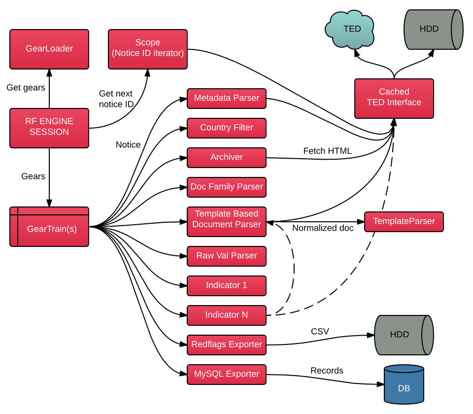

# Understanding the RED FLAGS engine

Previously we showed you the [bird's eye view](/maintainer/overview/#components) of the *Red Flags* architecture, now take a look at the engine itself, in details:




## Control & data flow

Let's see how the engine works.

1. Firstly, the main method is `RedflagsEngineApp.main()`. It handles special command line arguments that doesn't need the engine itself. If none of them were specified, it starts the Spring platform.
* Spring now takes the lead an initializes all components. The engine's first stage is `RedflagsEngineBoot`. It depends on `RedflagsEngineConfig` which will be filled with the configuration parameters.
* `RedflagsEngineBoot` calls `ScopeProvider` to select and instantiate the appropriate implementation of `AbstractScope`. [Scopes](/maintainer/engine/#scopes) are basically `NoticeID` iterators, you can find them in the `hu.petabyte.redflags.engine.scope` package.
* After that it creates and configures a `TedInterface` to be used by the engine later. `TedInterface` deals with the downloading from *TED* and also it manages the file cache.
* Then it calls `GearLoader` to load the appropriate gears (`Notice` processors).
* Lastly, `RedflagsEngineBoot` starts a new `RedflagsEngineSession`.
* `RedflagsEngineSession` receives the scope, the gears, and the thread count, and initializes the gears at first.
* Then it creates a thread pool, starts iterating over the notice IDs (using *scope*) and creates a `GearTrain` thread for each one of them.
* Lastly, it waits for all threads to finish.
* `GearTrain` objects are processor chains containing the *gears*. A chain is receiving an empty `Notice` object, gives it to the first gear, takes its result, gives it to the next gear and so on.
* Notices are not being collected, but there's an option for that in `RedflagsEngineSession`.


## Gear trains

`GearLoader` reads the gear list from the  `redflags.engine.gears` property. The default list is the following:

<pre>
redflags.engine.gears:

    # parse metadata
    - metadataParser
    #- cancelledNoticeFilter

    # skip non-Hungarian notices
    - countryFilter
    - originalLanguageFilter

    # download all tabs, and related notice tabs
    - archiver
    - docFamilyFetcher
    - docFamilyArchiver

    # skip further processing of old notices and tenders with non-classic dir.
    - publicationDateFilter
    - docFamilyDateFilter
    - directiveCorrector
    - directiveFilter

    # magic I. - parse document based on template
    - templateBasedDocumentParser
    - rawValueParser
    - frameworkAgreementParser
    - estimatedValueParser
    - renewableParser
    - countOfInvOpsParser
    - awardCriteriaParser
    - openingDateParser

    # magic II. - indicators
    - fwAgOneParticipantIndicator
    - fwAgFewParticipantsIndicator
    - fwAgLongDurationIndicator
    - fwAgHighEstimatedValueIndicator
    - contrDescCartellingIndicator
    - highEstimatedValueIndicator
    - totalQuantityHiDeltaIndicator
    - renewalOfContractIndicator
    - durationLongOrIndefiniteIndicator
    - persSitMissingCondIndicator
    - finAbMissingMinCondIndicator
    - finAbEquityCondIndicator
    - finAbRevenueCondExceedEstimValIndicator
    - finAbRevenueCondManyYearsIndicator
    - techCapMissingMinCondIndicator
    - techCapSingleContractRefCondIndicator
    - techCapExpertsExpCondManyYearsIndicator
    - techCapGeoCondIndicator
    - techCapRefCondExceedEstimValIndicator
    - techCapRefCondManyYearsIndicator
    - techCapEURefCondIndicator
    - procTypeAcceleratedIndicator
    - procTypeNegotiatedNoJustificationIndicator
    - countOfInvOpsLowIndicator
    - countOfInvOpsNoCondIndicator
    - awCritLacksIndicator
    - awCritPaymentDeadlineCondIndicator
    - awCritMethodMissingIndicator
    - deadlineIsTightIndicator
    - openingDateDiffersFromDeadlineIndicator
    - offerGuaranteeIsHighIndicator
    - finalValFarFromEstimValIndicator
    - procWithoutContractNoticeIndicator
    - numberOfOffersLowIndicator
    - unsuccessfulProcWithRiskIndicator
    - unsuccessfulProcWithoutInfo1Indicator
    - unsuccessfulProcWithoutInfo2Indicator
    - decisionDateDiffersFromOpeningDateIndicator
    - highFinalValueIndicator

    - contractingOrgInKMDBIndicator
    - winnerOrgInKMDBIndicator

    # output
    - H1FlagExporter
    - H2FlagExporter
    - mySQLExporter

    - stopGear
</pre>

Gears are being passed to a `GearTrain` with a notice. `GearTrain` objects are `Callable<Void>` instances, their `call` method will go through the gears and pass them the notice object in their `process` methods. The first gear receives a `Notice` object which has only the notice ID in it.

Gear trains have a **filter feature**: when a gear returns `null`, the the cycle breaks, the processing stops at that point.

See the `stopGear` at the end. The `StopGear` returns `null`, so stops the processing. **You should always have it at the end of your list**, because if you specify a gear list which is shorter than the default list, it only overwrites the first part of the list, and the rest of the default list will be also in use.

When a gear throws an exception, it will be logged by `GearTrain`, but the cycle continues with the next gear in line.

`GearTrains` are called by `RedflagsEngineSession` on separate threads. The size of the thread pool can be configured by the `threads` property.


## Gears in general

As I said before, gears are notice processors. They take an input notice and should return an output notice or `null`. Every gear is an **implementation of** `AbstractGear`. There is only one method that has to be implemented:

```java
protected abstract Notice processImpl(Notice notice) throws Exception;
```

This method is called by the `public final` method `process` after a null-check of the input notice. The `process` method is called by the `GearTrain`.

Additionally there are two methods for **gear initialization and finalization** which can be overridden: `beforeSession()` and `afterSession()`. They are called by `RedflagsEngineSession` before and after calling the `GearTrain`. When a `beforeSession` method throws an exception, the session ends at that point.

It is recommended not to use `@PostConstruct` annotation or `InitializingBean` when you need initialization because in that ways, the gear is being initialized at the application startup. But when you use the `beforeSession` method, the initialization will only be performed when the gear is present in the gear list.

Gears **must have** the `@Component` annotation, this way `GearLoader` can instantiate them using *Spring*. All `@Component` in *Spring* are **singletons**. If you need separate instances of a gear for every notice (for example for thread-safety), you should add `@Scope("prototype")` annotation to your gear class.

By default your the **bean name** of your gear is the class name with the first letter transformed to lower case. You can override this by adding the default argument to the `@Component` annotation: `@Component("CustomName")`. The bean name is used in the **gear list**.

**Property values** can be injected into gears, this way they are able to be configured out of the box. There is two way to do that:

* A) Add `@Value("${property.name}")` annotation to a field in your gear class.
* B) Add `@ConfigurationProperties(prefix = "mygear")` annotation to you gear class. After that any property having `mygear` prefix will be mapped to the fields of your gear class.

Also, you can use other gears in a gear, this way:

```java
@Autowired
private MyOtherGear otherGear;
```

But make sure you call `beforeSession` and `afterSession` of the other gear if needed.

Here's an example gear:

{!docs/incl/gear.md!}

We can categorize gears by their main tasks:

* There are **downloader** or **archiver** gears which fetch data from *TED* and store them in files.
* There are **parser** gears which turn the raw input files into an object model.
* There are **filter** gears which can throw out notices that are not needed.
* There are **indicator** gears which examine notices and generate flags.
* There are **exporter** gears which produce output from the notices.

Let's discuss their features.


## Downloader gears

Their task is to **fetch HTML documents** for a notice by either downloading them from *TED* and placing in the cache, or by reading directly from the cache if they already downloaded. They should be somewhere at the beginning of the list.

The mechanism mentioned above is implemented by [TedInterface](/developer/engine/tedinterface/).

[List of *Red Flags'* download gears](/developer/engine/gears/downloaders/)


## Parser gears

Parser gears process the downloaded data and fill in the POJOs. Like downloader gears, parser gears also doesn't have an abstract superclass to implement.

Some built-in parsers use downloader gears to fetch HTML content, and some of them

[List of *Red Flags'* parser gears](/developer/engine/gears/parsers/)


## Filter gears

A filter gear examines the current notice and decides whether it can reach the next processor or not. Conventionally these gears should implement the `AbstractFilter` class and its only one method: `boolean accept(Notice)`. Example:

{!docs/incl/filter.md!}

[List of *Red Flags'* filter gears](/developer/engine/gears/filters/)


## Indicator gears

A task of an indicators is to **examine something in a notice and generate one or zero flag**. Indicator classes should implement `AbstractIndicator` and its method `IndicatorResult flag(Notice)`.

All indicators have properties called `category` and `weight`, they can be used later in other gears or in the webapp, for example to differentiate displaying of flags. These values are initialized in `beforeSession` from `package.ClassName.category` and `package.ClassName.weight` properties. The default category is `null`, the default weight is `1.0`.

An `IndicatorResult` object contains the following things:

* `type` (`IndicatorResultType`)
* `flagCategory`
* `weight`
* `description`

The flag type can be one of these enum value: `MISSING_DATA, IRRELEVANT_DATA, NO_FLAG, FLAG`. `NO_FLAG` and `FLAG` is trivial, I think. `MISSING_DATA` can be used when some information needed by the indicator is missing from the notice. `IRRELEVANT_DATA` result type can be used to indicate the notice is not from the type that the indicator wants to process. Only the results with `FLAG` type will be displayed on the website.

The `description` is handled specially by the webapp. First of all it must be a **message label identifier**, e.g. "myindicator.desc". But you can pass actual information as **parameters** to be displayed in the webapp. Here's how:

* Create a message label in your `messages.properties` file like this:
<pre>
myindicator.desc="Some value ({v}) in the notice is higher than the threshold ({t})."
</pre>
* Then you can pass this as your flag description: `"myindicator.desc|v=139|t=100"`
* Finally, the webapp will display: `Some value (139) in the notice is higher than the threshold (100).`
* So you can enclose parameter names in brackets in your label, then you can pass `parameter=value` pairs separated by `|` in your `description`.

Fortunately `AbstractIndicator` has **helper methods** to generate description strings, and also complete `IndicatorResult` objects:

|
----------------------------------------------------------|---
`label(String label, String... args)`                     | generates a description string where the label identifier will be `flag.ClassName.specifiedLabel` and parameters will be the `param=value` pairs given in `args`
`irrelevantData()` and `missingData()`                    | generates `IndicatorResult` objects with the corresponding flag types
`returnFlag()`                                            | generates a result with label `flag.ClassName.info` and type `FLAG`, category and weight will be copied from the current indicator class
`returnFlag(String label, String... args)`                | lets you replace `info` to another label and add parameters
`returnFlag(double weight, String lable, String... args)` | lets you override the indicator's weight too

If you want to return `NO_FLAG` you can simply return `null` from your `flag(Notice)` method.

Let's see an example indicator:

{!docs/incl/indicator.md!}

There are 2 additional abstract classes, `AbstractTD3CIndicator` and `AbstractTD7Indicator`. They override the `flag` method by testing the document type and calling the abstract `flagImpl` method (same signature as `flag`) if the notice is contract notice (`TD-3` or `TD-C`) or contract award notice (`TD-7`).

[List of *Red Flags'* indicator gears](/developer/engine/gears/indicators/)


## Exporter gears

Exporter gears are usually on at the end of the list, their task is to produce an output from the parsed and generated data, such as CSV files or relational databases. Conventionally all exporter gears should implement `AbstractExporter` and its abstract method: `void export(Notice)`. Example:

{!docs/incl/exporter.md!}

[List of *Red Flags'* exporter gears](/developer/engine/gears/exporters/)